# How to make double-sided PCBs at home with a Carvera Air

This is a super in-progress guide for doing this. There's probably many better ways to do this, this is just what's worked for me.

## Materials, Tools, and Software

### Software

- KiCAD
- Makera's CAM
- Fusion 360
- FlatCAM
  This guide uses the 8.994 beta version of FlatCAM. There _will_ be differences between other versions, but the workflow should stay roughly the same.

### Materials

- Copper-clad FR4, duh.
- UV-curable solder mask (both in target solder mask colour and white, you'll see why).
- Some random ass wood. (should fit on the Carvera bed)
- Double sided tape.

### Tools

- The Carvera Air.
- Carvera's Laser Module.
- A 0.2mm corn bit/endmill.
- A 2mm/4mm drill bit.
- Makera's solder mask removal bit.

## Preparation

## The actual process

[stuff about exporting PCBs here]

### Import your PCB to FlatCAM

Open up FlatCAM and click on `File`. Then hover over `Open` and select `Open Gerber`. **ONLY** import your front and back copper layers. Don't import anything else.
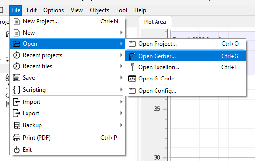

You should see your board on the newly opened side panel:
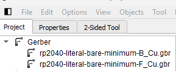

To make seeing them a little bit easier, feel free to select whatever colours you think they should have:
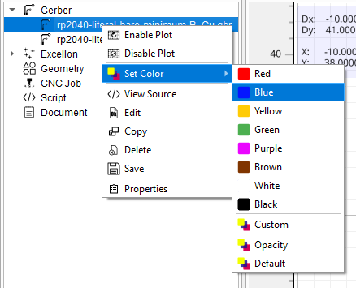

Having done that, you should see something like this:
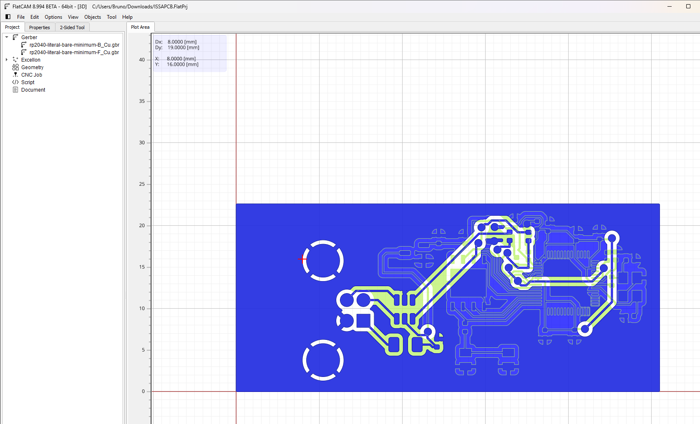

### Aligning your sides

It may seem like the boards are in the right orientation, but that is not the case. Remember, this is a 2D program and if you flip over the board, you will notice that it's almost as if it's _mirrored_. Let's fix that.

At the top of the UI, click on `Tool` and select `2-Sided PCB`:
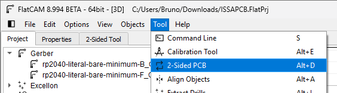

This will take you to a panel that looks something like this:
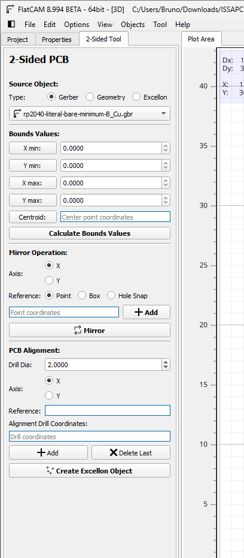

First, as the source object, select the _back side of the board_. I know that that's confusing, but this is the object that will end up getting mirrored. Horrible naming, but we can work with that.
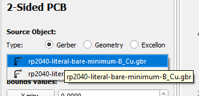

Let's now mirror our back side. in the Mirror Operation section of the 2-Sided PCB panel, select the X axis for your mirror operation (we'll be flipping the board over on its long side) and select Box as your reference. I've seen a YouTuber use Point and do some crazy ass math, but that's quite silly considering we're on a computer that can _compute_ it for us.

Next, as your reference object, select the front side of your board. If you've done this right, your Mirror Operation panel should look something like this:
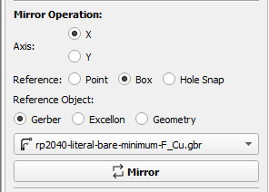

Looks great! Let's press Mirror to get it onto the right side. Things will feel a bit wrong now. If you've done this right, this is what it should look like:
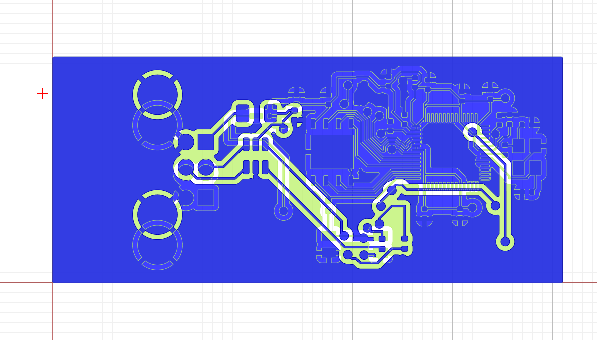

This seems wrong because our vias are not aligned. Remember, this is _Flat_ CAM. So what is happening here instead is that we're looking at our boards from the _top_, just like our CNC will. This means that if you physically flip over your soon-to-be board, you will see the same view as you are right now in FlatCAM.

### Adding alignment drills.

We're almost done with the 2-Sided PCB tool. All we need to do now, is make sure that we can somehow reliably align both sides on our CNC's work area. If you've ever done this manually, you'll know that it's basically impossible.

In the PCB Alignment section, set your drill diameter to the size of your alignment pins. I'm using the 2mm diameter dowel pins that came with the PCB fabrication toolkit, but you can use 4mm if you haven't bought it and are using the slightly larger pins that come with the machine itself.
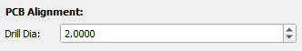

To do this accurately, we need to do some math.

Let's figure out where our alignment pins should be. Go back to the project tab in FlatCAM and find the front side of your board. Right click on it and select `Properties`.
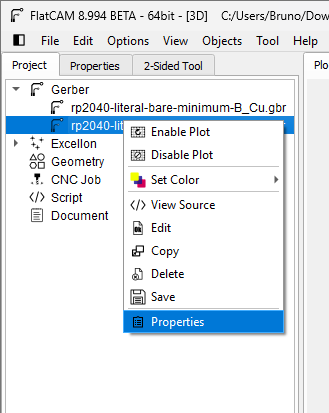

In there, you will see a dimensions section. This contains what we're looking for, the **Length** and **Width** of the board:
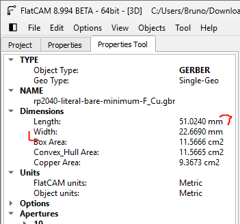

Make note of these and go back to the 2-Sided PCB tool like shown before.

In the PCB Alignment section, there will be a text field titled `Alignment Drill Coordinates`. We're calculating these because it's gonna be hard to get this right manually.

We want 4 drills on opposite corners of the board 3mm away from the board itself.

So what we want is:

- **A hole on the bottom left.**
  In my case, it's at `(0.0, -3.0)` because we're to the leftmost corner of the board, 3mm away from the bottom edge.
- **A hole on the top left.**
  In my case, that's `(0.0, 25.669)` because I want it on the same "line" as the left edge but 4mm away from the top edge (so $22.669+3=25.669$).
- **A hole on the bottom right.**
  In my case, that's at `(51.024, -3)` because we're at the rightmost corner of the board, 3mm away from the bottom edge.
- **A hole on the top right.**
  For me, that's at `(51.024, 25.669)` because I want it on the same "line" as the right edge but 4mm away from the top edge (so $22.669+3=25.669$).

This, in aggregate, is:
```(0.0000, -3.0000),(51.0240,-3),(0, 25.6690),(51.0240,25.6690)```

Let's punch these numbers into FlatCAM and click on `Create Excellon Object`.
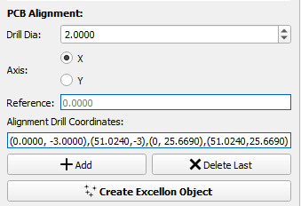

You should now see your alignment drills on the Plot Area.
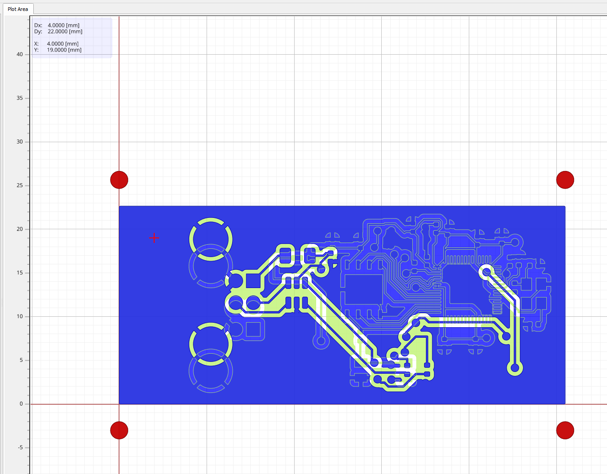

### Actually making gcode for the align drills.

I don't trust FlatCAM with doing these drilling ops. Partly because I'm not super familiar with it and partly because MakeraCAM makes it dead easy. Let's open up a new 3-axis project in MakeraCAM.


Now, set up your stock. Pick the PCB material and set the XYZ values to anything that fits with your board.
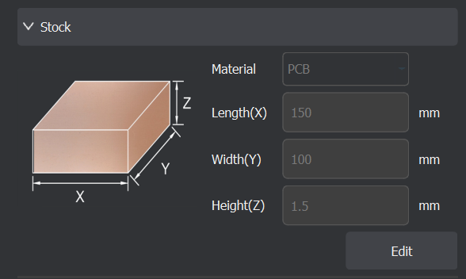

Now we're ready to drill some shit. Let's export our fresh Excellon drills from FlatCAM.
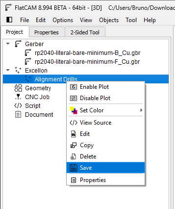

Save them somewhere they won't get lost and get back to MakeraCAM. In the layer panel, right click 2D layers and select `Import Graphic > Import PCB`.
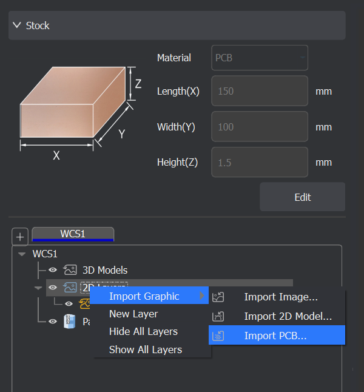

Once you import your drills, you should be able to see them in the layers panel and in the work area. Don't worry if the size is slightly wrong, that's okay.
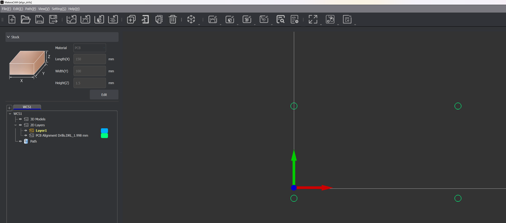
You'll also notice that they go outside of the "work area". **Don't move them by even a millimetre**. Just leave them as-is. This is fine and will be rectified later when we go to drill them.

Select all your drills by using MakeraCAM's `Select Graphics` options:
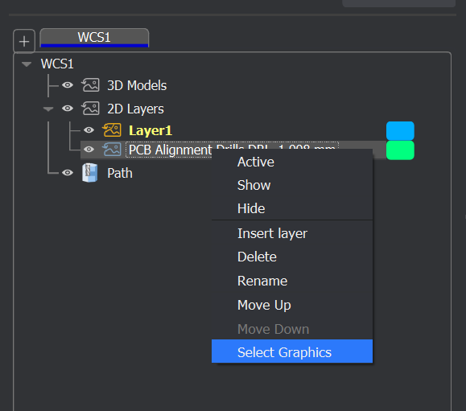

You should see them all get kind of dashy. With them selected, go into 2D toolpaths and select 2D drilling.
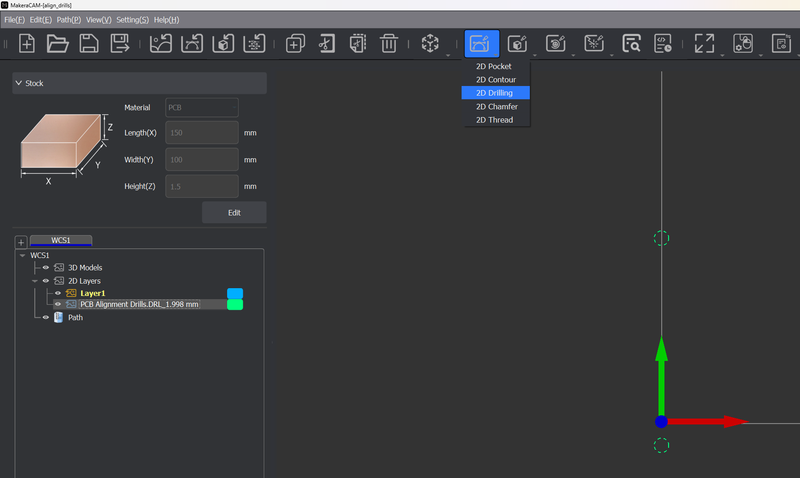

Let's sort out the settings. I'm using my 2mm drill. I used a clearance height of 5mm because there's nothing in the way of the toolhead as these drills are being created. Use feeds & speeds for PCBs. Your wooden base and bit will be fine (I think?). We're drilling 6mm down because the dowel pins are about 10mm in height, and we want them to be secure.
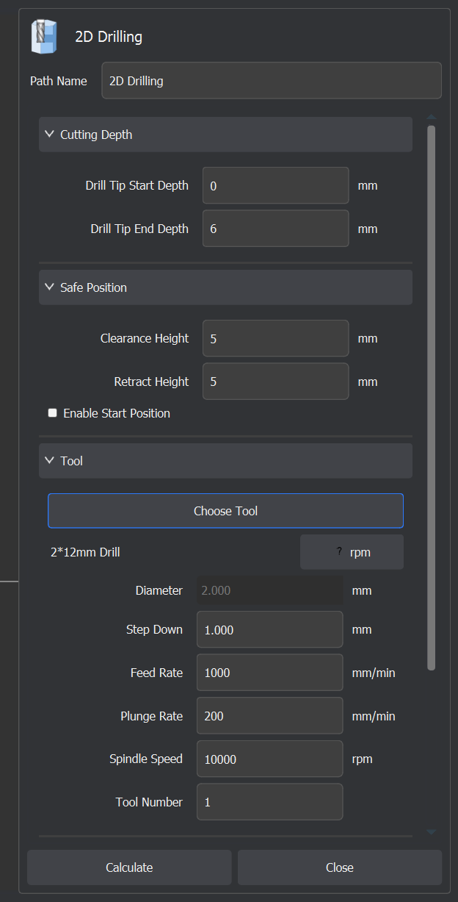

That's it! You're now ready to drill your alignment drills. Let's move onto generating the gcode for our top and bottom layers.

### Generating g-code for the front side of the PCB.

Let's go back to FlatCAM. Double click on the front layer of your PCB. That should bring you to this panel:
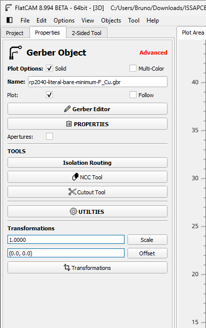

We will start by electrically isolating your traces. This removes material around only the traces. Click on `Isolation Routing`. You will now see a different panel:
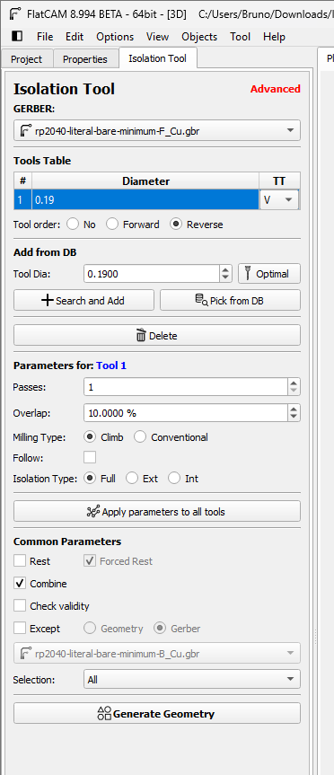

We will lie about our bits diameter. Double click what's currently in there and type in 0.19. This will make some of your traces slightly undersized. For me, that's worked out okay but YMMV. Then select the tool type. We're using a corn bit so any of the CX options are fine. Let's pick C1 for the vibes.
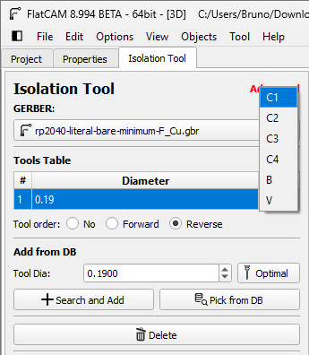
Now, right at the bottom, click on `Generate Geometry`. This will create geometry for us that we can later use to CNC the board.

You will see a bunch of toolpath parameters. In the path type, select `Iso`:
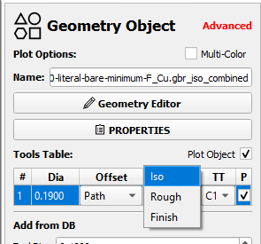

I'm setting my cut Z to -0.05. That's enough to get the copper off the board and get to the FR4 for me. Things might be different for you, so experimentation is king here. I'm using an XY feedrate of 120 and Z feedrate of 60. These tools are mad fragile so it's better to not fuck about. I'm also using a spindle speed of 15k because I've gotten the best results that way.
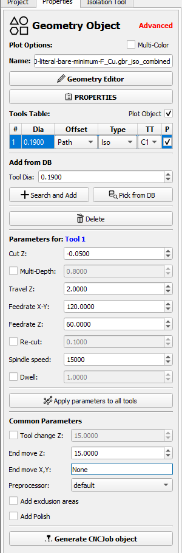

When you're done, click on `Generate CNCJob object`. This will generate actual gcode we can use. You will now see an actual toolpath forming. The panel will also give you an option to save your gcode. Do that and open the generated file in Notepad.

For the gcode-inclined among us, you'll notice that T1 and M6 are on separate lines:
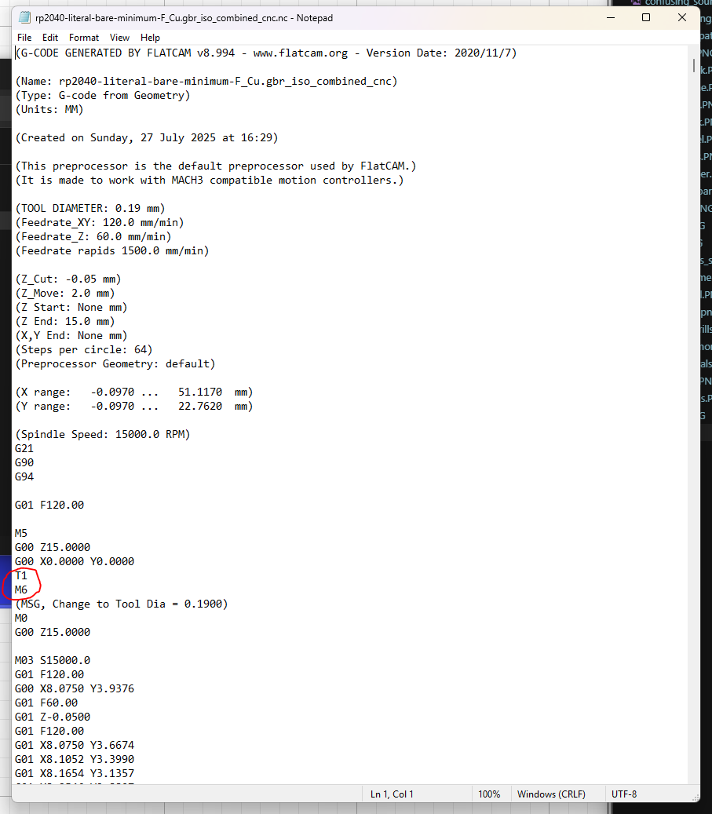
This makes the Carvera very angry. It stops the job and loses its heightmap. It's a nice machine so let's not make it angry. Delete the newline between these, add a space, and save. Here's what a fixed file looks like:
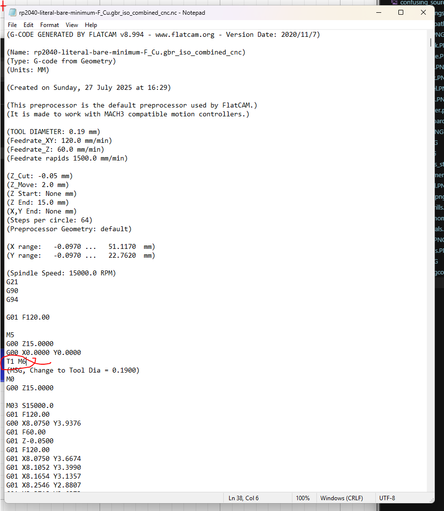
You'll need to do this for every CNCJob you save from FlatCAM. There's probably a fix for this. I haven't found it yet.

Let's now get back to the Project tab in FlatCAM. Double click on your front layer again. This will open up the Gerber Object panel again. This time, click on NCC Tool. That is the **n**on-**c**opper **c**leaning tool. Once again select the C1 tool type and a diameter of 0.19. Generate your geometry. Now, sometimes, that takes ages. Let it cook. It might complain that it couldn't fully isolate.
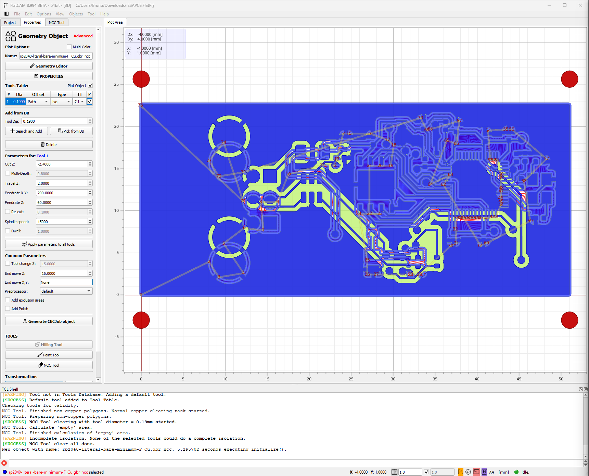
Sometimes it might even tell you where the polygons it failed to clear are. Double check that everything is still fine. It probably is.

Once you do, configure your toolpath. Most, if not all, of the settings will be the same as for isolating traces.
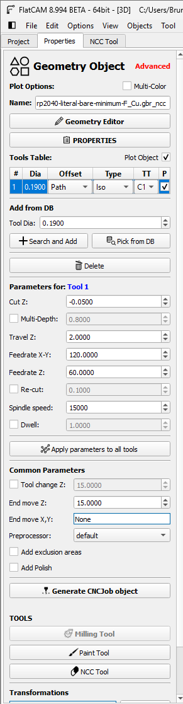
Once you're satisfied, click on the `Generate CNCJob object button`. Verify your toolpath and save your CNC code. Repeat the same steps as for the isolation gcode where we had to remove a newline from there.

### Generating g-code for the back side of the PCB.

Repeat the steps you did for the front side, just for the back side this time.

We're now officialy done with FlatCAM. We don't need to look at it again (yay!).

### Generating gcode for removing the front solder mask.

Let's open up a new 3-axis project in MakeraCAM.


Now, set up your stock. Pick the PCB material and set the XYZ values to anything that fits with your board.


In the layer panel, right click 2D layers and select `Import Graphic > Import PCB`.


Select your _front copper layer_. I know you'll be tempted to use the solder mask gerber. Because the solder mask gerber won't remove mask from the vias, It's not particularly useful to us.

Once you import your layer, it should look something like this:


You'll notice MakeraCAM helpfully created a pad layer for us. That's what we'll be primarily working with. Let's hide the non-pad layer.
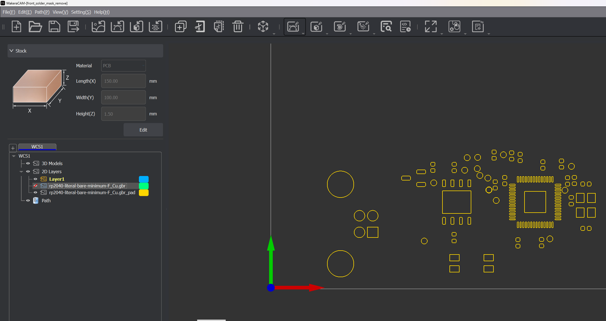

Right click on your pad layer and click on `Select graphics` to select all our pads & vias.

With that selected, select the 2D Pocket toolpath from the 2D options.
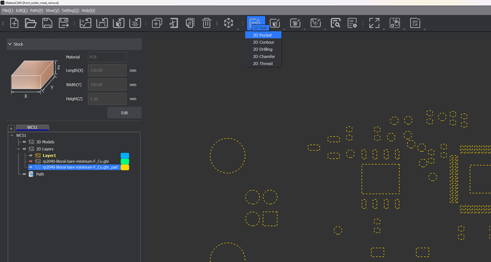

For this pocket, we are using the solder mask removal tool.
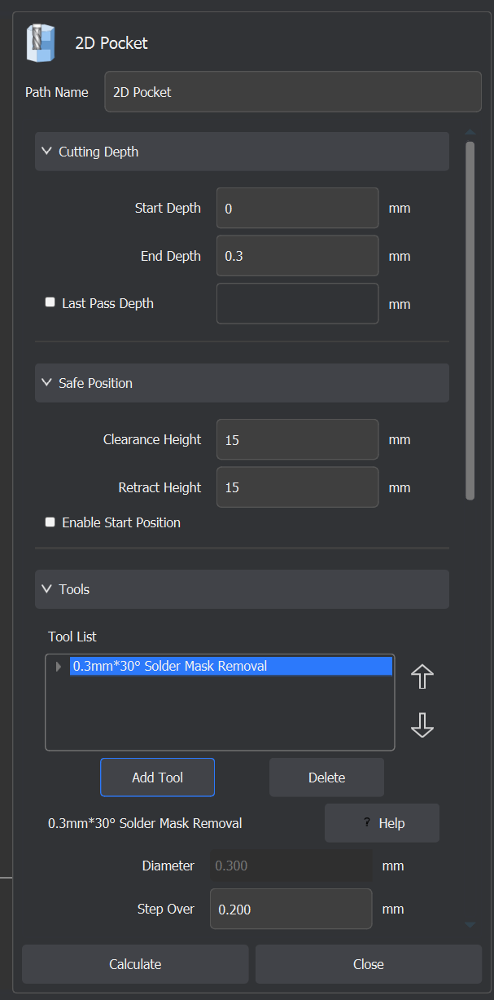
We're using a taller clearance height to avoid fucking the tool into our dowel pins. An end depth of 0.3mm has delivered solid results to me, but in the worst case one can re-run the toolpath with a higher depth. Anyways, let's run calculate.

Great! It seems like everything was calculated. Wait, not everything. Some of the pads are too small!
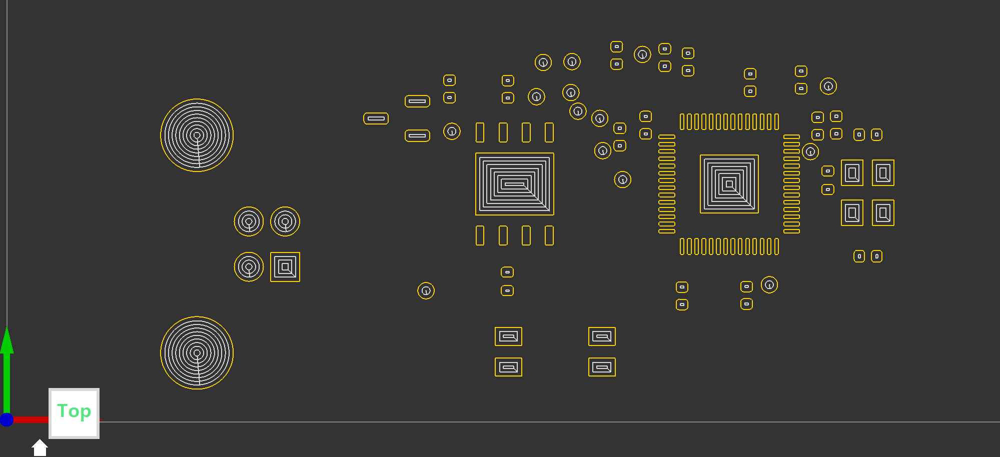
Don't worry, I have a trash quality solution to this that works unnecessarily well.

Start by holding down `Shift` and left clicking on pads that weren't generated. Group this by the _size of the pad_. So for example, I'm not gonna do the RP2040 pads because they're small as fuck. We'll start with the NOR flash:
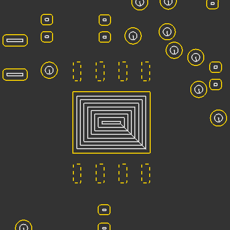
Now, let's create a new pocket toolpath. Same settings as before with one change. We will use the offset option.
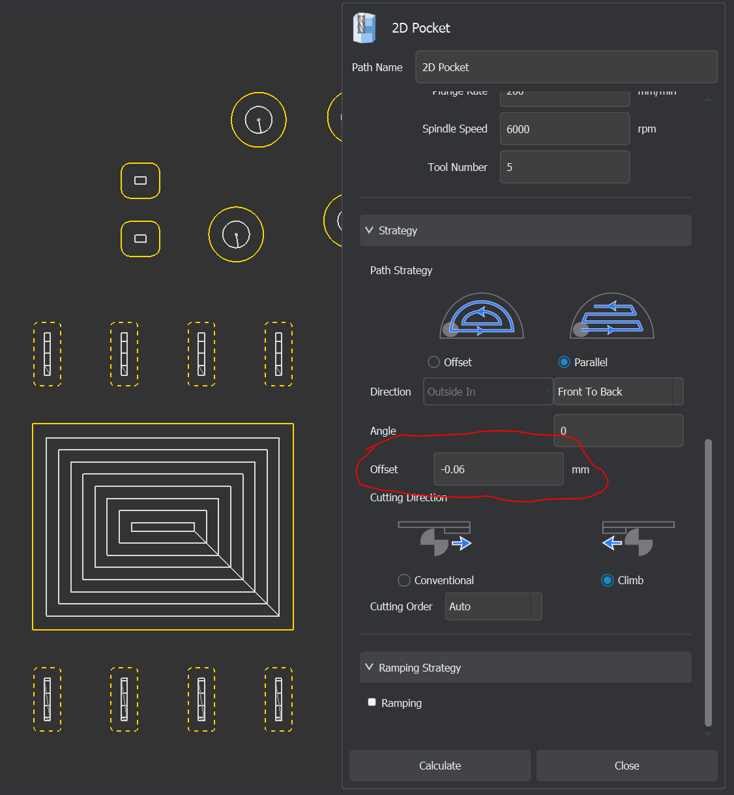
This will force MakeraCAM to generate a toolpath by making it pretend our selected graphic is larger than it actually is. This _does_ make pads slightly larger than they should be. But in reality, with our NCC toolpaths and solder mask spread, this usually means that the extra removed soldermask is still kind of there because it goes deeper than the tool does. You'll see that in a photo later.

Now, let's do the RP2040 pads (as an example of some smaller pads). let's start with the ones oriented horizontally. Do the same offset trick. Here's where it gets funky. These pads are small as shit so ripping them off is SUPER easy. You want to _minimise the amount of time the tool spends on the pad_. And also, you want to minimise the pad itself. So experiment until you find the smallest possible offset that makes the machine mill the pads.

This will take experimentation. Take your time with it. Do the same for the vertical pads now.

When you're done, your Carvera should have toolpaths for all your pads.
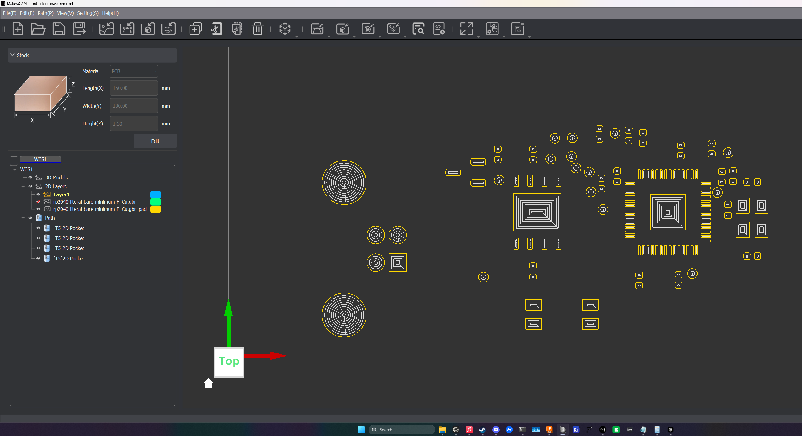

Export your gcode and save for later.

### Generating the gcode for removing the back solder mask.

Unlike FlatCAM, you don't need to mirror anything in MakeraCAM. Just create a new project and repeat the above process.

### Generating the gcode for lasering on the front silkscreen.

Let's open up a new 3-axis project in MakeraCAM.


Now, set up your stock. Pick the PCB material and set the XYZ values to anything that fits with your board.


In the layer panel, right click 2D layers and select `Import Graphic > Import PCB`.


Import your front silkscreen layer.

### Generating the gcode for lasering on the back silkscreen.

About the same as the front silkscreen. Remember, don't mirror anything. You don't need to do that in MakeraCAM.