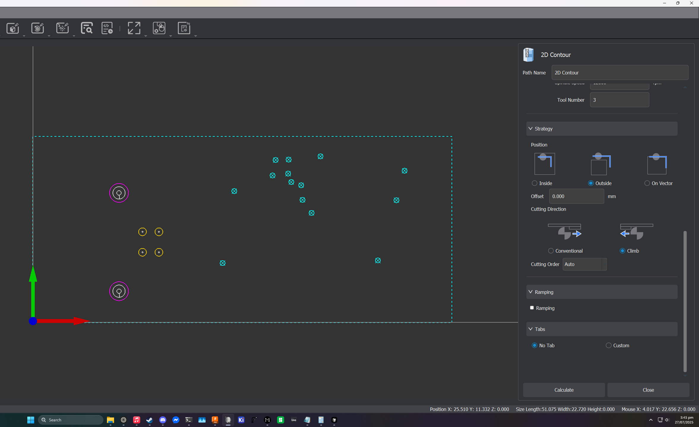
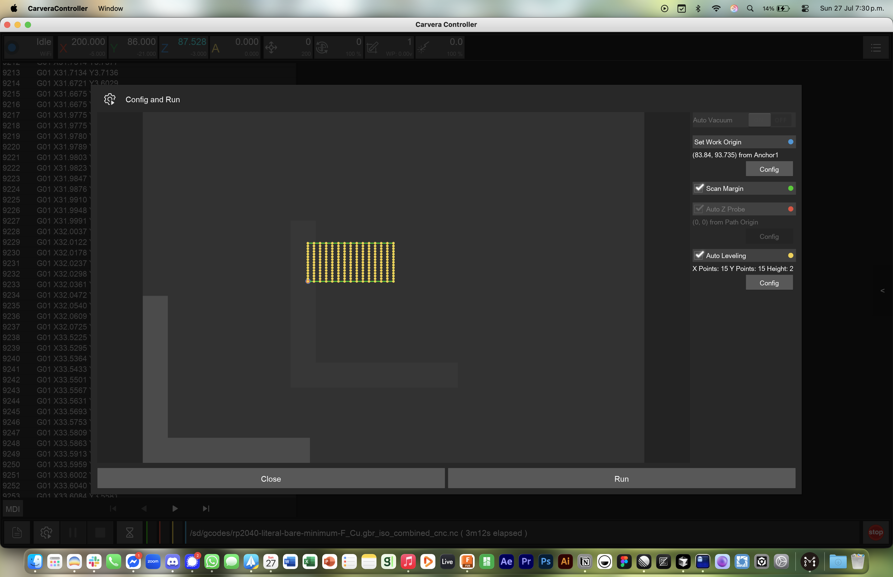

# How to make double-sided PCBs at home with a Carvera (Air)

This is a super in-progress guide for doing this. There's probably many better ways to do this, this is just what's worked for me.

## Table of Contents

- [How to make double-sided PCBs at home with a Carvera (Air)](#how-to-make-double-sided-pcbs-at-home-with-a-carvera-air)
  - [Table of Contents](#table-of-contents)
- [Materials, Tools, and Software](#materials-tools-and-software)
  - [Software](#software)
  - [Materials](#materials)
  - [Tools](#tools)
- [Preparation](#preparation)
  - [Making a PCB-friendly wasteboard.](#making-a-pcb-friendly-wasteboard)
  - [Making sure copper chips aren't fucking with our mill quality.](#making-sure-copper-chips-arent-fucking-with-our-mill-quality)
- [Going from PCB to Gcode.](#going-from-pcb-to-gcode)
  - [Creating your PCB in KiCAD](#creating-your-pcb-in-kicad)
    - [Quick note about text](#quick-note-about-text)
    - [Board setup](#board-setup)
    - [Pre-export work](#pre-export-work)
    - [Actually exporting the damn thing.](#actually-exporting-the-damn-thing)
  - [Importing your PCB to FlatCAM.](#importing-your-pcb-to-flatcam)
    - [Aligning your sides](#aligning-your-sides)
  - [Adding alignment drills.](#adding-alignment-drills)
  - [Actually making gcode for the align drills.](#actually-making-gcode-for-the-align-drills)
    - [Generating g-code for the front side of the PCB.](#generating-g-code-for-the-front-side-of-the-pcb)
  - [Generating g-code for the back side of the PCB.](#generating-g-code-for-the-back-side-of-the-pcb)
  - [Generating gcode for removing the front solder mask.](#generating-gcode-for-removing-the-front-solder-mask)
  - [Generating the gcode for removing the back solder mask.](#generating-the-gcode-for-removing-the-back-solder-mask)
  - [Generating the gcode for lasering on the front silkscreen.](#generating-the-gcode-for-lasering-on-the-front-silkscreen)
  - [Generating the gcode for lasering on the back silkscreen.](#generating-the-gcode-for-lasering-on-the-back-silkscreen)
  - [Generating the gcode for drills and edge cuts.](#generating-the-gcode-for-drills-and-edge-cuts)
- [Milling the board, lasering the board, and other random side quests.](#milling-the-board-lasering-the-board-and-other-random-side-quests)
  - [Attaching the fixture \& adding the fan.](#attaching-the-fixture--adding-the-fan)
  - [Attaching the PCB.](#attaching-the-pcb)
  - [Finding the 0 point and setting up work coordinates.](#finding-the-0-point-and-setting-up-work-coordinates)
  - [Drilling alignment holes.](#drilling-alignment-holes)
  - [Front copper isolation.](#front-copper-isolation)
  - [Front non-copper clearing](#front-non-copper-clearing)


# Materials, Tools, and Software

## Software

- KiCAD

- Makera's CAM

- Fusion 360

- FlatCAM

  This guide uses the 8.994 beta version of FlatCAM. There _will_ be differences between other versions, but the workflow should stay roughly the same.

## Materials

- Copper-clad FR4, duh.

- UV-curable solder mask (both in target solder mask colour and white, you'll see why).

- Some random ass wood for milling the PCB fixture. (should fit on the Carvera bed)

- TPU to make a spindle fan

- Double sided tape.

## Tools

- The Carvera Air.

- 3D printer (optional)

- A UV light.

- Shop vac (optional)

- The sanding block that came with the Carvera

- Carvera's Laser Module.

- A 0.2mm corn bit/endmill.

- A 2mm/4mm drill bit.

- Makera's solder mask removal bit.

- Corn bits in other various sizes.

- Drill bits also in other various sizes.

# Preparation

## Making a PCB-friendly wasteboard.

The MDF wasteboard on the Carvera isn't super friendly to milling PCBs so we need to make our own thing to which we will attach PCBs. Fortunately enough, I've solved this problem already by making a Carvera friendly thing that can accomodate large-ish PCBs and screws into the bed. It isn't entirely my own creation, it's based on [this guide's](https://hackaday.io/project/202478/instructions) fixture created by [Vedran](https://hackaday.io/vedranMv). I only modified it to hold larger PCBs. You don't need to mill all the holes, it's really only the screwholes that matter. Here's a photo of mine.


I made it out of some random wood my landlord had in her shed. Just make if flat enough and you'll be fine.

You can get the [Fusion project here](./projects_and_gcode/fusion/PCB%20fixture%20thing.f3d) or the [STEP file here](./projects_and_gcode/step/PCB%20fixture%20thing.step).

## Making sure copper chips aren't fucking with our mill quality.

When the bit you're using mills it's own chips (or in this case, dust), you get more burrs and more bullshit. To prevent this you can either use a vaccuum attached to your Carvera or a delightful fan.


[RedGT500](https://www.printables.com/@RedGT500_1977691) has already made a great fix to this. A 3D printable fan made out of TPU that's made to go on your spindle. You can even see mine in that photo of the fixture above. You can download it [here](https://www.printables.com/model/1332188-carvera-spindle-fan-beefy-version/files). I've also reuploaded it [here](./projects_and_gcode/step/Spindle%20Fan.step) to protect against link rot.

# Going from PCB to Gcode.

## Creating your PCB in KiCAD

Teaching you to actually make PCBs is outside the scope of this guide. God knows I know fuck all about making PCBs or CNC. What I do know is how I made my PCB so that it works with this process.

This doesn't affect making your schematic, so I'm gonna skip right over to the PCB editor.

### Quick note about text

First, if you think any text you make is gonna look fine, you're sorely mistaken. Don't even bother. Hide all the text and make sure it doesn't end up in the final exports.

### Board setup

Let's move onto the money shot.

- The minimum clearance between tracks should be 0.2mm (you _can_ set 0.1mm and have good results but you have to mind yourself so you don't get the tracks too close together, this is relevant for some smaller ICs or USB-C ports).
- The minimum track width should be 0.2mm (NOT any lower unless you have tiny ass bits, which I don't and haven't tested).
- Your minimum via diameter should be 0.9mm (so that you can drill 0.6mm holes for them). Smaller vias will be a pain in the ass, don't even bother with them.
- Your copper to hole clearance should be 0.25mm. You can go lower (as low as 0.2mm), but I wouldn't recommend it.
- Your copper to edge clearance should be 0mm. This way KiCAD won't force FlatCAM to mill the shit out of the boards edges wasting your time and bit life.
- Your minimum through-hole should be 0.3mm (or the smallest bit you've got).
- Your hole to hole clearance should be 0.2-0.25mm.

### Pre-export work

To make our board show up consistently in the right spot in all of the pieces of software we'll be using, you gotta set a grid & drill/place origin.

In KiCAD's PCB editor, select the `Grid Origin` option.


Then, place it at the bottom left corner of your board.


Now, press and hold the grid origin button until a second option pops out.


That's the drill origin button. Click on that and place it in the same spot as the grid origin.


You are now ready to export your board.

### Actually exporting the damn thing.

Click on `File > Fabrication Outputs > Gerbers`.


Now, select the output folder, select your layers, select `Use drill/place file origin`. First, click on `Generate Drill Files` and also select `Drill Origin > Drill/place file origin`, then click on `Generate Drill File` and close. Then, click on `Plot`. Your board should now have the required outputs to be milled in the folder you selected.


(I've taken this photo from [Vedran's guide](https://hackaday.io/project/202478/instructions) because I'm on macOS Tahoe and KiCAD's export window is freaking OUT on it)

You should now have the Gerbers you need to mill your board.

## Importing your PCB to FlatCAM.

Open up FlatCAM and click on `File`. Then hover over `Open` and select `Open Gerber`. **ONLY** import your front and back copper layers. Don't import anything else.


You should see your board on the newly opened side panel:


To make seeing them a little bit easier, feel free to select whatever colours you think they should have:


Having done that, you should see something like this:


### Aligning your sides

It may seem like the boards are in the right orientation, but that is not the case. Remember, this is a 2D program and if you flip over the board, you will notice that it's almost as if it's _mirrored_. Let's fix that.

At the top of the UI, click on `Tool` and select `2-Sided PCB`:


This will take you to a panel that looks something like this:


First, as the source object, select the _back side of the board_. I know that that's confusing, but this is the object that will end up getting mirrored. Horrible naming, but we can work with that.


Let's now mirror our back side. in the Mirror Operation section of the 2-Sided PCB panel, select the X axis for your mirror operation (we'll be flipping the board over on its long side) and select Box as your reference. I've seen a YouTuber use Point and do some crazy ass math, but that's quite silly considering we're on a computer that can _compute_ it for us.

Next, as your reference object, select the front side of your board. If you've done this right, your Mirror Operation panel should look something like this:


Looks great! Let's press Mirror to get it onto the right side. Things will feel a bit wrong now. If you've done this right, this is what it should look like:


This seems wrong because our vias are not aligned. Remember, this is _Flat_ CAM. So what is happening here instead is that we're looking at our boards from the _top_, just like our CNC will. This means that if you physically flip over your soon-to-be board, you will see the same view as you are right now in FlatCAM.

## Adding alignment drills.

We're almost done with the 2-Sided PCB tool. All we need to do now, is make sure that we can somehow reliably align both sides on our CNC's work area. If you've ever done this manually, you'll know that it's basically impossible.

In the PCB Alignment section, set your drill diameter to the size of your alignment pins. I'm using the 2mm diameter dowel pins that came with the PCB fabrication toolkit, but you can use 4mm if you haven't bought it and are using the slightly larger pins that come with the machine itself.


To do this accurately, we need to do some math.

Let's figure out where our alignment pins should be. Go back to the project tab in FlatCAM and find the front side of your board. Right click on it and select `Properties`.


In there, you will see a dimensions section. This contains what we're looking for, the **Length** and **Width** of the board:


Make note of these and go back to the 2-Sided PCB tool like shown before.

In the PCB Alignment section, there will be a text field titled `Alignment Drill Coordinates`. We're calculating these because it's gonna be hard to get this right manually.

We want 4 drills on opposite corners of the board 3mm away from the board itself.

So what we want is:

- **A hole on the bottom left.**
  In my case, it's at `(0.0, -3.0)` because we're to the leftmost corner of the board, 3mm away from the bottom edge.
- **A hole on the top left.**
  In my case, that's `(0.0, 25.669)` because I want it on the same "line" as the left edge but 4mm away from the top edge (so $22.669+3=25.669$).
- **A hole on the bottom right.**
  In my case, that's at `(51.024, -3)` because we're at the rightmost corner of the board, 3mm away from the bottom edge.
- **A hole on the top right.**
  For me, that's at `(51.024, 25.669)` because I want it on the same "line" as the right edge but 4mm away from the top edge (so $22.669+3=25.669$).

This, in aggregate, is:
```(0.0000, -3.0000),(51.0240,-3),(0, 25.6690),(51.0240,25.6690)```

Let's punch these numbers into FlatCAM and click on `Create Excellon Object`.


You should now see your alignment drills on the Plot Area.


## Actually making gcode for the align drills.

I don't trust FlatCAM with doing these drilling ops. Partly because I'm not super familiar with it and partly because MakeraCAM makes it dead easy. Let's open up a new 3-axis project in MakeraCAM.


Now, set up your stock. Pick the PCB material and set the XYZ values to anything that fits with your board.


Now we're ready to drill some shit. Let's export our fresh Excellon drills from FlatCAM.


Save them somewhere they won't get lost and get back to MakeraCAM. In the layer panel, right click 2D layers and select `Import Graphic > Import PCB`.


Once you import your drills, you should be able to see them in the layers panel and in the work area. Don't worry if the size is slightly wrong, that's okay.


You'll also notice that they go outside of the "work area". **Don't move them by even a millimetre**. Just leave them as-is. This is fine and will be rectified later when we go to drill them.

Select all your drills by using MakeraCAM's `Select Graphics` options:


You should see them all get kind of dashy. With them selected, go into 2D toolpaths and select 2D drilling.


Let's sort out the settings. I'm using my 2mm drill. I used a clearance height of 5mm because there's nothing in the way of the toolhead as these drills are being created. Use feeds & speeds for PCBs. Your wooden base and bit will be fine (I think?). We're drilling 6mm down because the dowel pins are about 10mm in height, and we want them to be secure.


That's it! You're now ready to drill your alignment drills. Let's move onto generating the gcode for our top and bottom layers.

### Generating g-code for the front side of the PCB.

Let's go back to FlatCAM. Double click on the front layer of your PCB. That should bring you to this panel:


We will start by electrically isolating your traces. This removes material around only the traces. Click on `Isolation Routing`. You will now see a different panel:


We will lie about our bits diameter. This is so that FlatCAM actually mills them. Your tool's supposed to be smaller than your traces. But it's fine if it's equal to their width. So fuck it, let's lie. It _does_ work. Double click what's currently in there and type in 0.19. This will make some of your traces slightly undersized. For me, that's worked out okay but YMMV. Then select the tool type. We're using a corn bit so any of the CX options are fine. Let's pick C1 for the vibes.


Now, right at the bottom, click on `Generate Geometry`. This will create geometry for us that we can later use to CNC the board.

You will see a bunch of toolpath parameters. In the path type, select `Iso`:


I'm setting my cut Z to -0.05. That's enough to get the copper off the board and get to the FR4 for me. Things might be different for you, so experimentation is king here. I'm using an XY feedrate of 120 and Z feedrate of 60. These tools are mad fragile so it's better to not fuck about. I'm also using a spindle speed of 15k because I've gotten the best results that way.


When you're done, click on `Generate CNCJob object`. This will generate actual gcode we can use. You will now see an actual toolpath forming. The panel will also give you an option to save your gcode. Do that and open the generated file in Notepad.

For the gcode-inclined among us, you'll notice that T1 and M6 are on separate lines:


This makes the Carvera very angry. It stops the job and loses its heightmap. It's a nice machine so let's not make it angry. Delete the newline between these, add a space, and save. Here's what a fixed file looks like:


You'll need to do this for every CNCJob you save from FlatCAM. There's probably a fix for this. I haven't found it yet.

Let's now get back to the Project tab in FlatCAM. Double click on your front layer again. This will open up the Gerber Object panel again. This time, click on NCC Tool. That is the **n**on-**c**opper **c**leaning tool. Once again select the C1 tool type and a diameter of 0.19. Generate your geometry. Now, sometimes, that takes ages. Let it cook. It might complain that it couldn't fully isolate.


Sometimes it might even tell you where the polygons it failed to clear are. Double check that everything is still fine. It probably is.

Once you do, configure your toolpath. Most, if not all, of the settings will be the same as for isolating traces.


Once you're satisfied, click on the `Generate CNCJob object button`. Verify your toolpath and save your CNC code. Repeat the same steps as for the isolation gcode where we had to remove a newline from there.

## Generating g-code for the back side of the PCB.

Repeat the steps you did for the front side, just for the back side this time.

We're now officialy done with FlatCAM. We don't need to look at it again (yay!).

## Generating gcode for removing the front solder mask.

Let's open up a new 3-axis project in MakeraCAM.


Now, set up your stock. Pick the PCB material and set the XYZ values to anything that fits with your board.


In the layer panel, right click 2D layers and select `Import Graphic > Import PCB`.


Select your _front copper layer_. I know you'll be tempted to use the solder mask gerber. Because the solder mask gerber won't remove mask from the vias, It's not particularly useful to us.

Once you import your layer, it should look something like this:


You'll notice MakeraCAM helpfully created a pad layer for us. That's what we'll be primarily working with. Let's hide the non-pad layer.


Right click on your pad layer and click on `Select graphics` to select all our pads & vias.

With that selected, select the 2D Pocket toolpath from the 2D options.


For this pocket, we are using the solder mask removal tool.


We're using a taller clearance height to avoid fucking the tool into our dowel pins. An end depth of 0.3mm has delivered solid results to me, but in the worst case one can re-run the toolpath with a higher depth. Anyways, let's run calculate.

Great! It seems like everything was calculated. Wait, not everything. Some of the pads are too small!


Don't worry, I have a trash quality solution to this that works unnecessarily well.

Start by holding down `Shift` and left clicking on pads that weren't generated. Group this by the _size of the pad_. So for example, I'm not gonna do the RP2040 pads because they're small as fuck. We'll start with the NOR flash:


Now, let's create a new pocket toolpath. Same settings as before with one change. We will use the offset option.


This will force MakeraCAM to generate a toolpath by making it pretend our selected graphic is larger than it actually is. This _does_ make pads slightly larger than they should be. But in reality, with our NCC toolpaths and solder mask spread, this usually means that the extra removed soldermask is still kind of there because it goes deeper than the tool does. You'll see that in a photo later.

Now, let's do the RP2040 pads (as an example of some smaller pads). let's start with the ones oriented horizontally. Do the same offset trick. Here's where it gets funky. These pads are small as shit so ripping them off is SUPER easy. You want to _minimise the amount of time the tool spends on the pad_. And also, you want to minimise the pad itself. So experiment until you find the smallest possible offset that makes the machine mill the pads.


This will take experimentation. Take your time with it. Do the same for the vertical pads now.

When you're done, your Carvera should have toolpaths for all your pads.


Export your gcode and save for later.

## Generating the gcode for removing the back solder mask.

Unlike FlatCAM, you don't need to mirror anything in MakeraCAM. Just create a new project and repeat the above process.

## Generating the gcode for lasering on the front silkscreen.

Let's open up a new 3-axis project in MakeraCAM.


Now, set up your stock. Pick the PCB material and set the XYZ values to anything that fits with your board.


In the layer panel, right click 2D layers and select `Import Graphic > Import PCB`.


Import your front silkscreen layer.


Any text you have needs to go. I haven't figured out how to make it legible yet but it'll legitimately look like trash.


Just delete it.


Now, this part you can only do after experimenting a little bit. The laser is _very_ slightly off from where the mill ends up. This will cause your silkscreen to be off. I still haven't gotten the right offsets, but here's how to apply them.

Right click your silkscreen layer in the layers section of MakeraCAM and click on `Select Graphics`.


Now, click on the transform menu and select `Move`.


You will be brought to a delightful panel for moving shit. It'll tell you your current selection's location:


Now, my last proof board turned out like this:


It looks like on the X axis we are too far to the right (so, we need to compensate by subtracting) and on the Y axis we are too far to the bottom (so we need to compensate by adding).

I'm gonna try -0.75mm on the X axis and +0.3mm on the Y axis.

Based on the values in the move panel:

- X axis
  $24.579-0.75=23.829$
- Y axis
  $11.161+0.3=11.461$

Let's type that into MakeraCAM.


Great, with our paths translated we're ready to create our laser toolpaths.

Now, this is very important, **select things by their thickness**. Group things as thick as each other together. This way, you can get a result that doesn't look like shit.

In my case, there's only a few tiny bits that have the same thickness. Let's select everything else for now.


From the laser toolpaths dropdown, select Laser Vector.


As for settings, set speed at a hilariously low 30mm/min and power at 3%. We're not actually trying to engrave or cut anything (you'll see when we actually run the toolpaths), we're exploiting the laser's wavelength to use it to selectively cure the white soldermask. Set the indent distance at _the lowest possible value that still generates a complete toolpath_. Pair that with using the laser in line mode. The thinnest laser path can generate the thickest solder mask, so it's better to err on the cautious side.


Now, thing by thing generate your thicker paths with the appropriate indent distances. The thicker it is, the higher the indent distance should be.

With all the toolpaths done, you can now export your gcode and stash it for later.


## Generating the gcode for lasering on the back silkscreen.

About the same as the front silkscreen. Remember, don't mirror anything. You don't need to do that in MakeraCAM. Some text may be mirrored once you import. That's deceiving. Ignore it and just delete.

## Generating the gcode for drills and edge cuts.

This will be the last toolpath for our PCB.

Let's open up a new 3-axis project in MakeraCAM.


Now, set up your stock. Pick the PCB material and set the XYZ values to anything that fits with your board.


In the layer panel, right click 2D layers and select `Import Graphic > Import PCB`.


Import your PTH, NPTH, and edge cut layers.


For creating drill holes, there are 2 strategies. You can use a 2D Pocket toolpath or a 2D Drill toolpath. The drill toolpath is greatly preferred because it risks your pads less. If you don't have the right sized drills though, you can make do with a pocket and very often your PCB will be okay. We will use both strategies here because it's fun.

Let's start by using plain ol' drills. Right click the layer that has the right sized drills for your bits and click on `Select Graphics`.


Now, select the 2D Drilling toolpath from the 2D toolpaths dropdown.


As for the settings, you want to drill 1.6mm down to ensure you go fully through the board. This will make a delightful hole in your wooden block. That's fine because the bit should survive this blunder. Remember to use a drill that matches your layer drill size.


Now, let's do the pleb way of drilling a hole - the 2D pocket toolpath. Select the drills you don't have the proper bits for and select 2D Pocket from the 2D toolpaths dropdown.


Select a corn bit smaller than your smallest drill size. Make it mill 1.6mm down to make sure we get all of the board.


For the strategy, we're doing outside in. I've gotten the best results with that.


Almost done with our last toolpath! Let's cut the board out of the stock. Now, edge cuts are sneaky little shits. It doesn't look like it, but there's two of them. Zoom in and delete the smaller one.


Select your edge cut (NOT cuts!) and select the 2D Contour toolpath from the 2D toolpaths dropdown.


For these, use your _biggest_ corn bit. Otherwise, it'll look like shit. Again, cutting 1.6mm down.


To not end up fucking our board, pick the outside strategy.



Last one, so the board doesnt go flying out of the FR4, add some tabs. Click on custom, make them triangle shaped, and select `Add`.


Now, click roughly in the centre of each edge of the contour.


Sick. Now press `Exit Add` and calculate your toolpath.


You can now export your g-code. Since we're using many corn bits, MakeraCAM will complain about tool numbers. Change them up until you're happy with the numbers. Just make each tool have a different one.

With your g-code exported, you're now ready to mill some shit. Let's get to making everything.

# Milling the board, lasering the board, and other random side quests.

## Attaching the fixture & adding the fan.

Let's get started by screwing in the fixture and adding the fan. Take anything in the spindle out of the spindle and press fit the fan. After that, reference the photo below to see where the fixture screws in. Use the medium-long screws that come with the Carvera.


## Attaching the PCB.

Put double sided tape all over the back of the PCB.


Then, stick it on the fixture. Avoid putting any drills around the screws at the bottom of the fixture. Make sure there's enough space to flip the board over while keeping the entirety of it on the fixture itself.


Feel free to use the roller from the PCB fabrication kit (if you bought it) to ensure the adhesive is nice and squished.


## Finding the 0 point and setting up work coordinates.

Insert the leveling probe into the spindle.


Let's open up the Carvera Controller. Connect to the machine and click on the top right button. Then, select the device diagnose menu. In there, turn on the probe laser.


You will see the laser come alive. Now, exit the diagnose menu and go into the manual control menu.


Here, move the toolhead until the laser pointer is pointing at where you want the X and Y zero points to be (where the PCB starts). Remember that some of the align holes are at minus points when doing this. If you feel like things are moving too slow or too fast, change how fast the Carvera moves the axes.


Find your zero point.


Once you're happy with the zero point, let's start running the alignment hole job.

## Drilling alignment holes.


When you click on start job, you will see a work origin and leveling menu. Your toolhead is at the X and Y zero point right now. Let's let the machine know about that by clicking `Config` under `Set Work Origin` and setting the anchor as `Current Pos`.


Let's move onto leveling. You don't need to go super crazy here, the drills just need to be accurate enough.


Let's start our job and wait until it's done.


Okay, there's holes now! Get rid of the debris using a vacuum.


After you've cleared them, put the dowel pins in. From now on, **anytime you're machining the board the dowel pins should be in it**. That will prevent unnecessary movement and ensure alignment.


## Front copper isolation.

Let's move onto the fun stuff. Load up the copper isolation job.


**DO NOT** change the work origin settings. These will now stay the same for the entire duration of us milling this board.

We will change the levelling settings though. We want to be absolutely certain we have all the weird imperfections accounted for. Use 15 levelling points. Yeah, it's a lot. Yeah, it'll take ages. And yeah, it's worth it.



Great! Let's wait for our machine to be done.


Nice result!


## Front non-copper clearing

Let's now move onto milling out the non-copper sections. Load up the NCC job.


Now, before you run it, **DO NOT** enable any option that requires the probe. We want the Carvera to reuse it's heightmap. Doing that will cause it to clear it and you'll get worse results.


Let's wait for NCC to be done.


